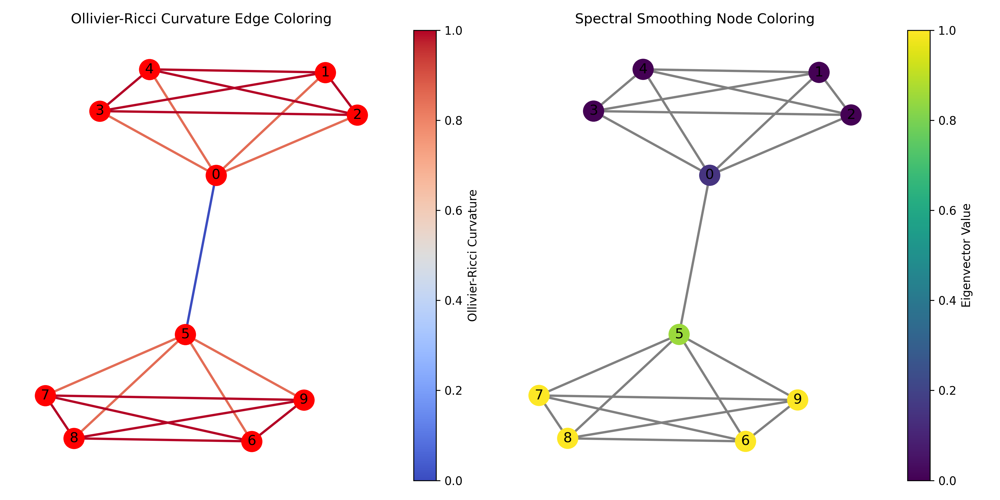

# Fast Methods of Spectral and Curvature-Based Rewirings for Oversmoothing/Squashing in GNNs

## Spectral Oversmoothing and Oversquashing Reduction (SOOR)

The SOOR method is motivated by the connection between the graph Laplacian and signal smoothness. The graph Laplacian matrix $L=D-A$, where $D$ is the diagonal degree matrix and $A$ the adjacency matrix, is an operator that captures the smoothness of signals on a graph. Its quadratic form measures the total variation of a signal $x$ on the graph:

$$x^\top L x = \frac{1}{2} \sum_{(i,j)\in E} (x_i - x_j)^2$$

This expression can be seen as an energy function that quantifies the discrepancy between signal values across connected nodes. Minimizing this energy encourages smoother signals, where connected nodes have similar values.

The eigenvectors of the Laplacian matrix provide a basis for the graph's signal space, with the corresponding eigenvalues indicating the smoothness of each basis vector. The eigenvector associated with the zero eigenvalue is the constant vector, representing the trivial smoothest signal where all nodes have the same value. The eigenvectors corresponding to the smallest non-zero eigenvalues capture the smoothest non-trivial signals on the graph, as they minimize the total variation while being orthogonal to the constant vector.

In the context of oversmoothing in GNNs, SOOR aims to find and remove edges that contribute the most to the mixing of information across the graph. By computing the first $k$ non-trivial eigenvectors of the Laplacian (i.e., those associated with the smallest non-zero eigenvalues) and measuring the similarity between the values assigned to nodes connected by each edge, SOOR identifies edges that have the strongest influence on signal smoothing. Removing these edges helps to alleviate oversmoothing by reducing the mixing of information along the smoothest graph modes.

The figure above illustrates the motivation behind using curvature as a measure for finding graph bottlenecks and edges that cause oversmoothing (as done in Nguyen et al. 2023 for instance), and the coloring of the same graph using the coordinates of the eigenvector corresponding to the smallest non-zero eigenvalue of the Laplacian matrix (right). The discrepancies in these values assigned to nodes are then used to determine what edges to add or remove in the SOOR algorithm.

## Conceptual Comparison with First-order Spectral Rewiring (FoSR)

The SOOR method differs from the First-order Spectral Rewiring (FoSR) method (Karhadkar et al., 2023) in terms of their objectives and rewiring strategies. While FoSR aims to alleviate oversquashing by greedily adding edges that maximize the first-order approximation of the increase in the spectral gap, SOOR focuses on reducing oversmoothing by removing edges that contribute the most to signal smoothing based on the Laplacian eigenvectors.

FoSR uses the first-order approximation of the spectral gap to guide the edge addition process, whereas SOOR directly utilizes the smoothest eigenvectors of the Laplacian to identify edges for removal. This difference in the spectral properties used for rewiring leads to different strategies for mitigating oversmoothing and oversquashing in GNNs.

More experimentation is to be done to see if this approach is useful. Oversquashing was not implemented.

## Acknowledgement

This project was done as a part of a project for Harvard University's APMTH 220 Geometric Methods for Machine Learning course.